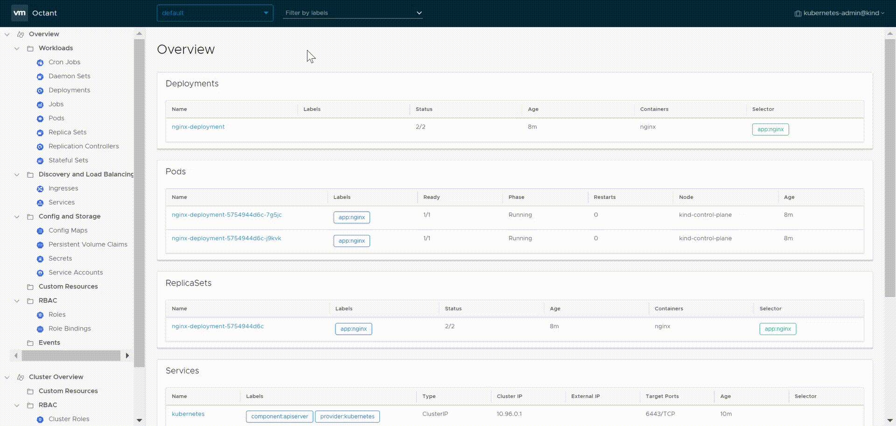

# <!-- fit -->  Operating Kubernetes
(AKS style)

---
# How do we authenticate?

1. X509 Certificates
2. Tokens (long-lived)
3. OIDC

---
# AKS : Authenticate to cluster

In AKS, X509 certificates are retrieved using `az` CLI:

```
az aks get-credentials --resource-group myResourceGroup --name myAKSCluster
```

Creates /updates ~/.kube/config with credentials

---
# Practical

Authenticate against demo cluster

Success = running `kubectl get nodes`

---
# Exploring with Octant



---
# Practical

1. Download and install https://github.com/vmware/octant
2. Use Octant to explore the demo cluster

---
# Exploring with Kubectl


---
# Practical

1. Show nodes with kubectl
2. Examine container logs
3. Describe a pod, service
4. Exec into a pod

---

# YAML

* VSCode plugins


--- 

# Minikube

