# <!-- fit -->  What is Kubernetes?

---

# Evolution of Containers

---

# So what is Kubernetes?

1) Kubernetes is a portable, extensible, open-source platform for managing containerized workloads and services.
2) It facilitates both declarative configuration and automation. 
3) It has a large, rapidly growing ecosystem - Kubernetes services, support, and tools are widely available.

---

# What is Kubernetes **NOT**

1) PaaS 
2) CI/CD - It won't build your app or containers, or manage source control or deployments
3) Opinionated - Many ways to achieve a result
4) Hardware management
5) For the weak!!! 💪

---

# Story Time

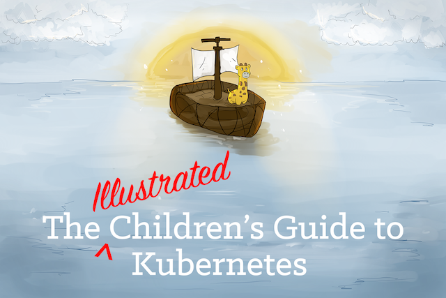

https://www.cncf.io/the-childrens-illustrated-guide-to-kubernetes/

---

# Application

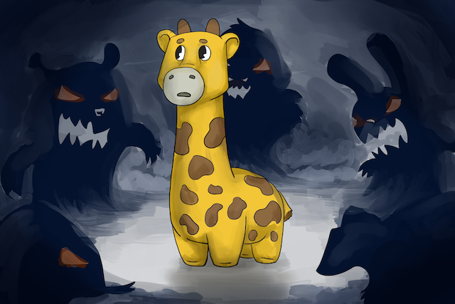

---

# Application

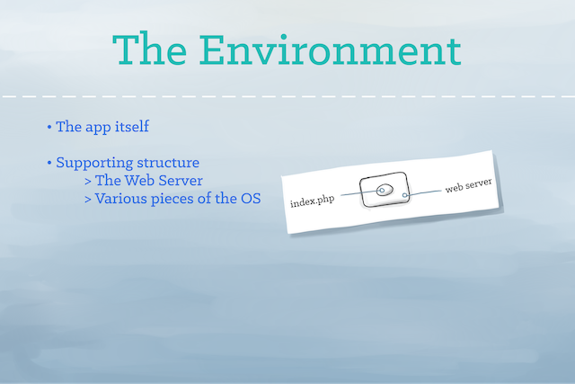

---

# Container

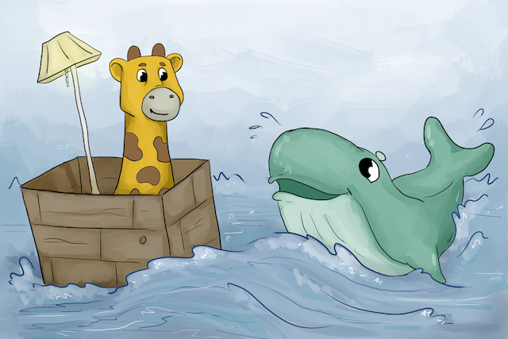

---

# Container

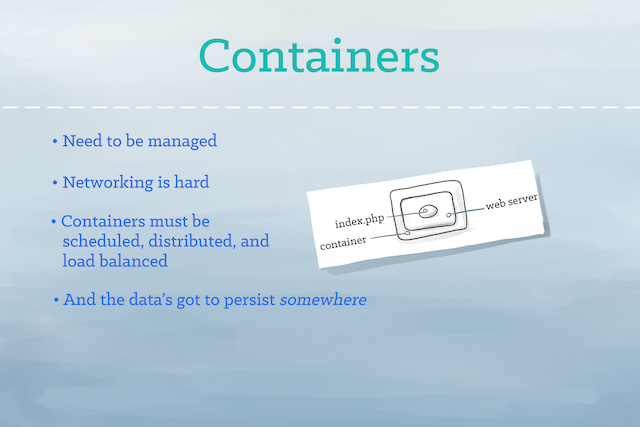

---

# Kubernetes

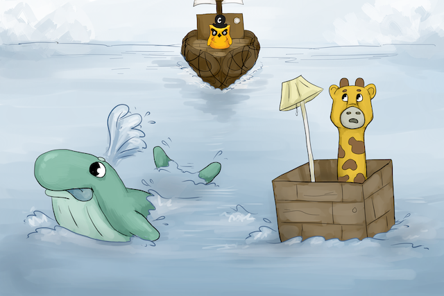

---

# Kubernetes

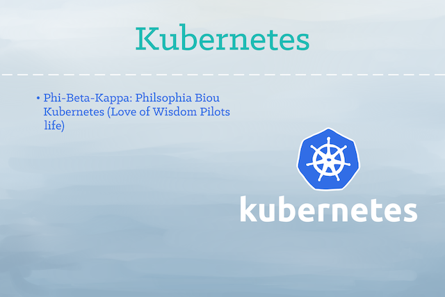

---

# Labels

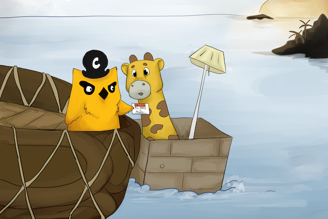

---

# Labels

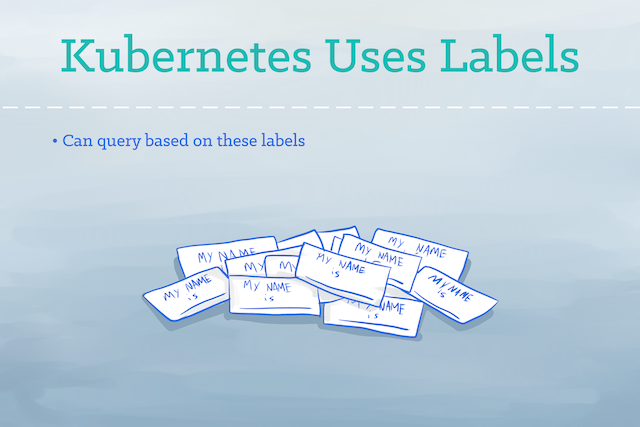

---

# Pods

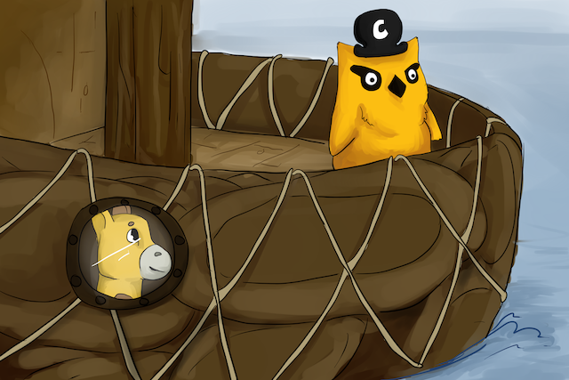

---

# Pods

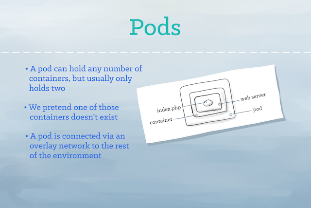

---
# ReplicaSets

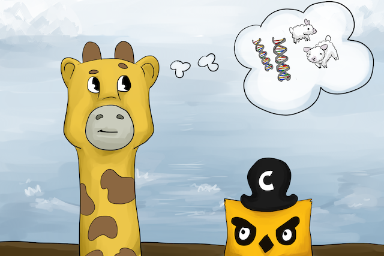

---

# ReplicaSets

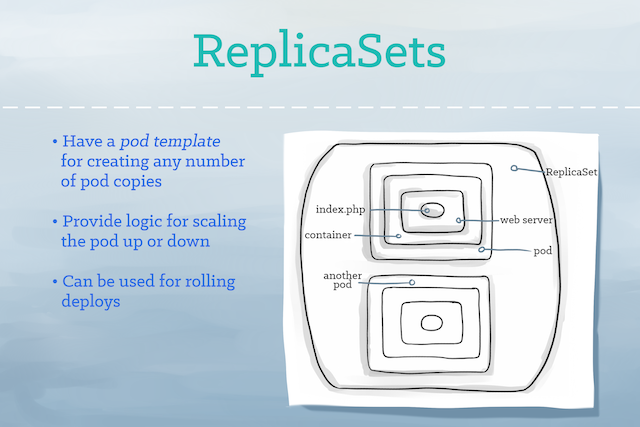

---

# Services

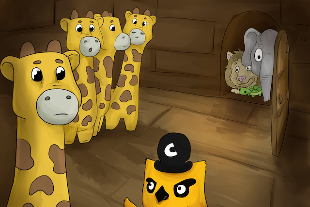

---

# Services

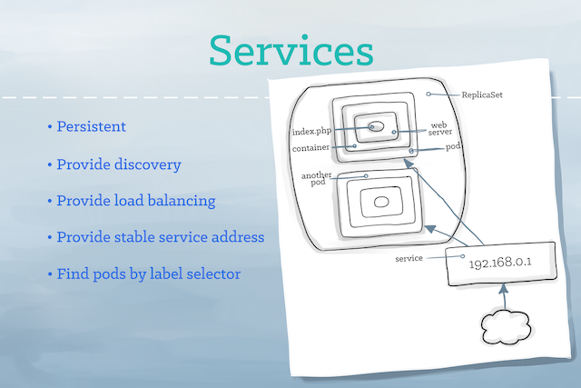

---

# Volumes

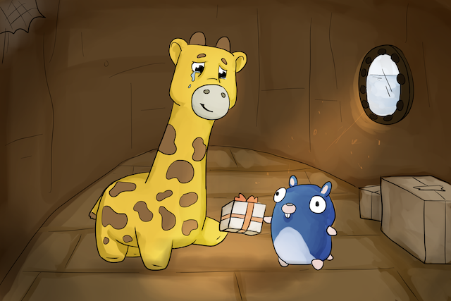

---

# Volumes

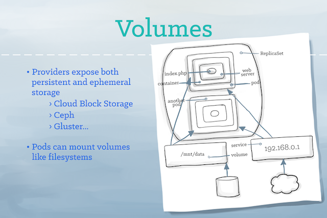

---

# Namespaces

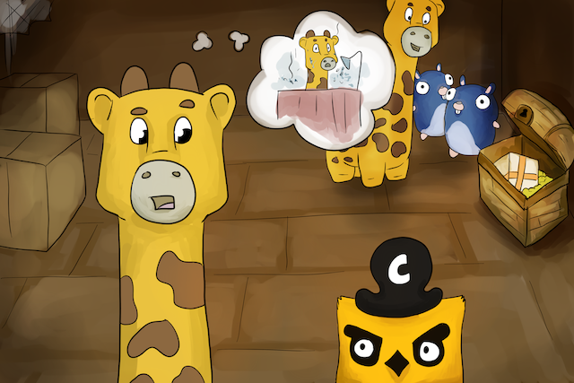

---

# Namespaces

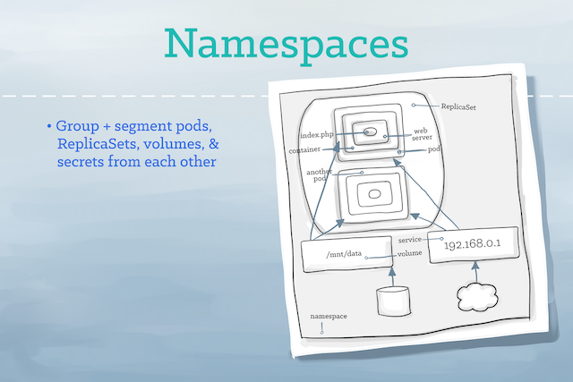

---

# Happily Every After

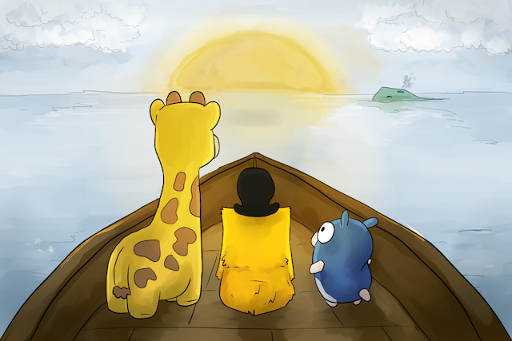

---

# <!-- fit --> But wait.. 

---
# Fun at the Zoo

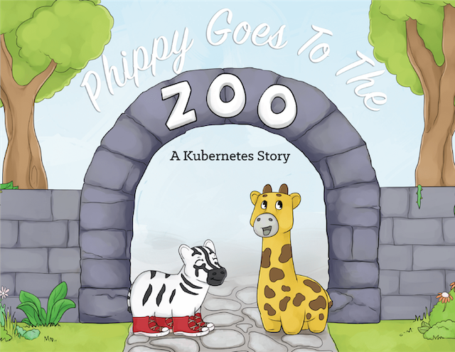

---
# Pods

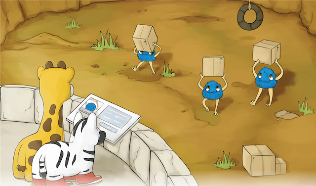

---
# Pods

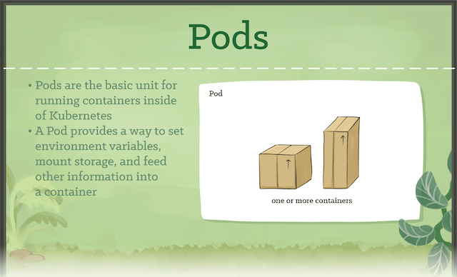

---
# ReplicaSets

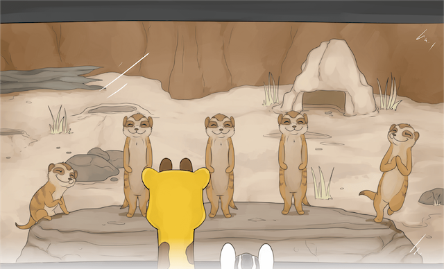

---
# ReplicaSets

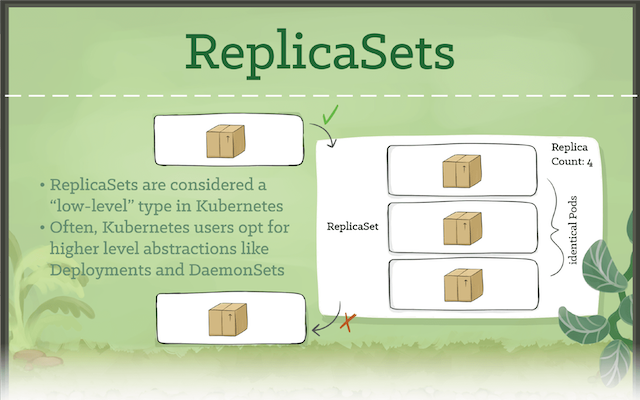

---
# Secrets

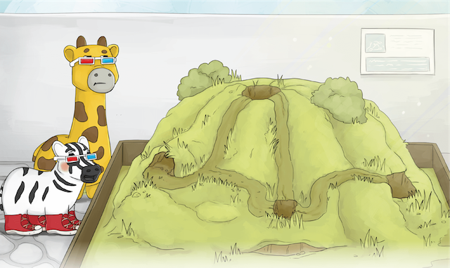

---
# Secrets

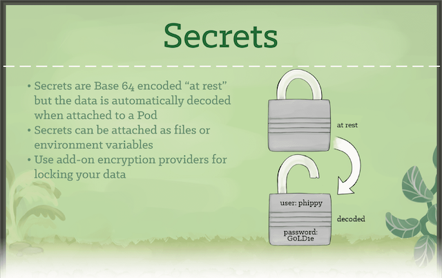

---
# Deployments

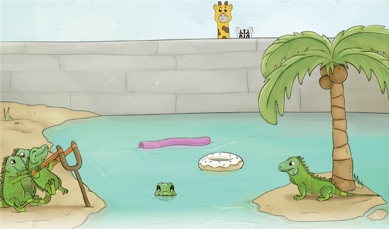

---
# Deployments

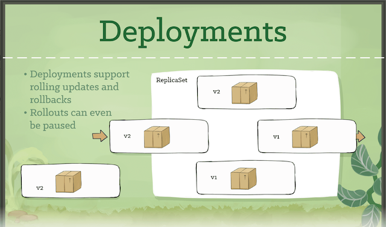

---
# DaemonSets

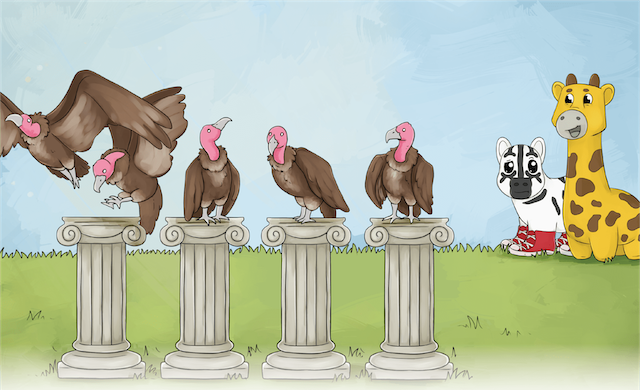

---
# DaemonSets

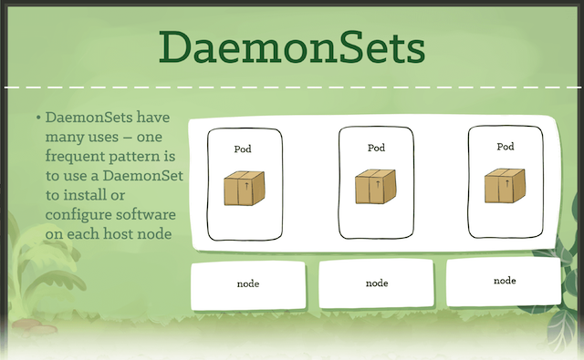

---
# Ingresses

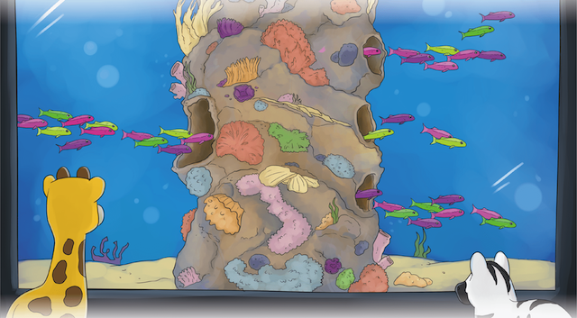

---
# Ingresses

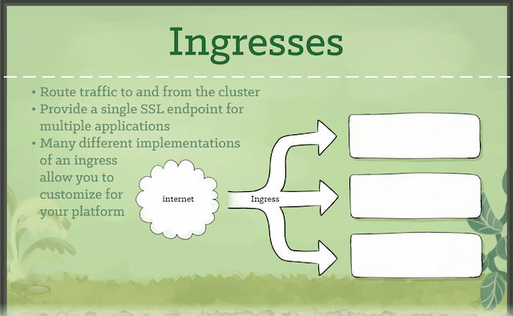

---
# CronJobs

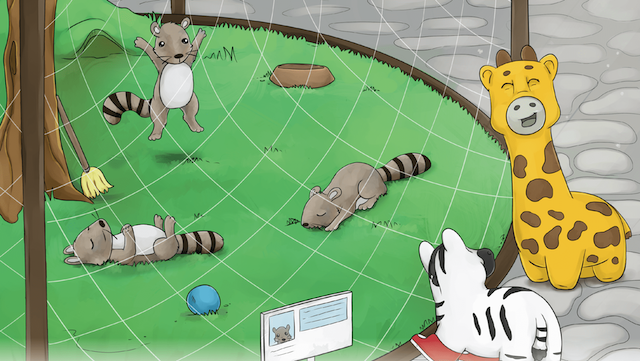

---
# CronJobs

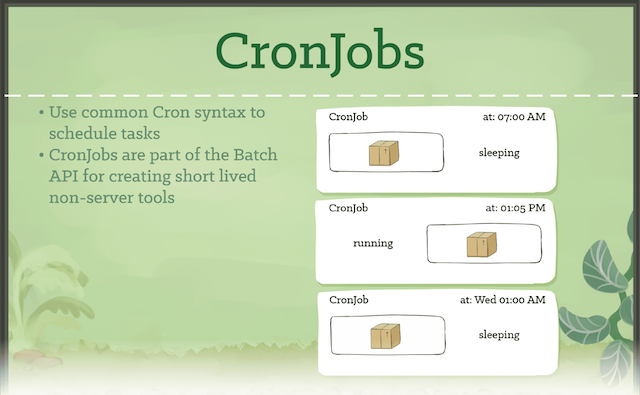

---
# CRDs

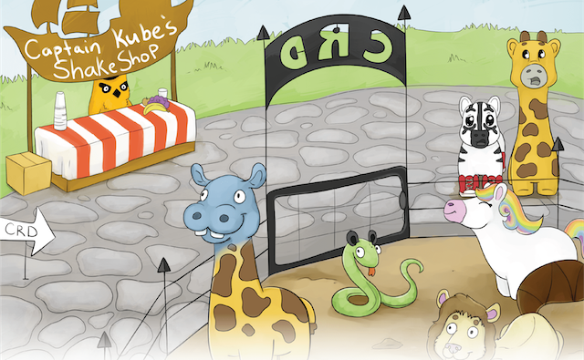

---
# CRDs

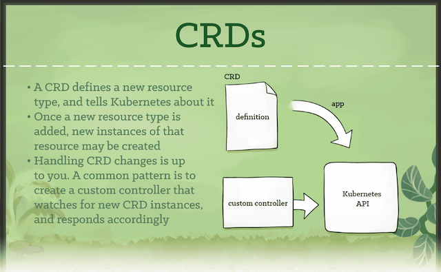

---
# The End

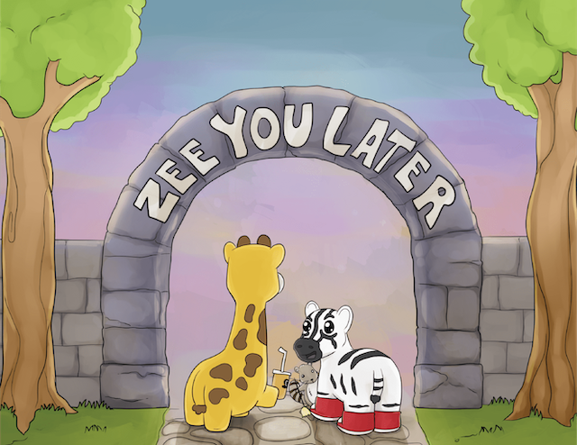

